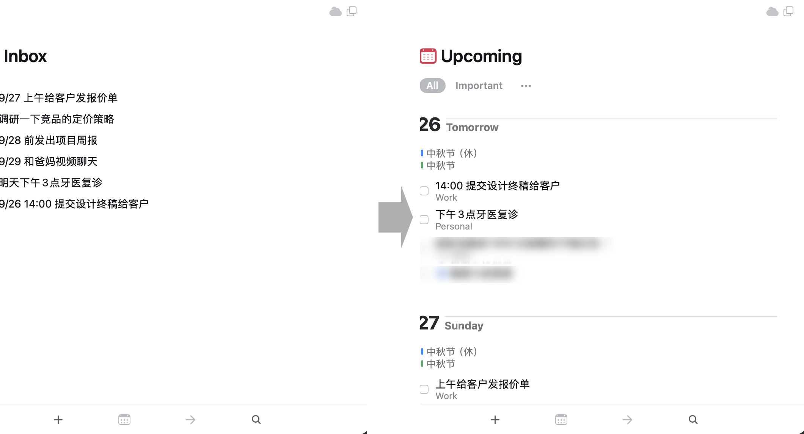

<p align="center">
  
</p>
<h1 align="center">things-inbox-organizer</h1>
<p align="center">
  用 LLM 自动整理 <a href="https://culturedcode.com/things/">Things 3</a> 的 Inbox：判断区域、
  <b>从自然语言里抽取真实日期</b>排进 When、清理标题。<br/>
  你的收集箱从"堆放区"变回"进站口"。
</p>

---

## 解决什么问题

GTD 的规则是"收集要快，整理要定期"，但现实是：

- 待办从四面八方进来（手机速记、Siri、Telegram bot、邮件），Inbox 越堆越多
- 手动整理 = 判断区域 + 算日期 + 改标题，每条 10 秒，攒 20 条就懒得动了
- 已有的 AI 整理方案普遍把日期简化成 `今天/近期/someday` 三档 ——
  **条目里写的真实日期（"9/25"、"下周三"）根本没被读**，排期系统性错位

本项目的核心就是第三点：让 LLM 输出 `YYYY-MM-DD`，由代码校验后用 AppleScript
`schedule` 到那一天。相对日期以**条目创建日**为基准换算（不是运行日），
所以网络故障、Mac 关机导致的延迟运行不会算错。

## 效果

**整理前** —— 待办随手丢进 Inbox，日期混在标题里，没有区域归属；
**整理后** —— 自动归入区域（条目下方小字）、日期排进 When（Upcoming 按天分组）、
标题清理干净（`9/26 14:00 提交设计终稿` → When=周六 + 标题只剩 `14:00 提交设计终稿`），
`9/28 前发出` 这类截止语义写进 notes 而不占日期：



## 整体架构：一条三段式 AI 流水线

```
【上游】你身边的 AI 助理，把"随口一句话"变成结构化待办
┌────────────────────────────────────────────────────────────┐
│  Telegram 上的 chat agent（如 Hermes）                      │
│  「提醒我周五给老板发周报」                                  │
│    → LLM 识别提醒意图，解析「周五」→ 2026-09-25             │
│    → things:///add?title=...&when=2026-09-25               │
│    → Bark 推送到 iPhone → 点一下 → 进 Things Cloud          │
│      （实现见 integrations/hermes-things-bridge/）          │
│                                                            │
│  或者：邮件 / 手动速记 —— 任何能进 Inbox 的方式都行          │
└────────────────────────────────────────────────────────────┘
                          │
                          ▼  Things Cloud 同步，Mac 的 Inbox 出现这条待办
                          │
【下游】本工具（Mac 端 launchd，每 2 小时）
┌────────────────────────────────────────────────────────────┐
│  1. AppleScript 读出 Inbox 全部条目（含创建日期）            │
│  2. GLM 批量抽取：area + date(YYYY-MM-DD) + is_deadline     │
│     + 清理后的标题                                          │
│  3. 代码校验（过期/非法日期一律不排，绝不猜）                 │
│  4. AppleScript 写回：移入区域、schedule 设 When、           │
│     deadline 写 notes、清理标题                              │
└────────────────────────────────────────────────────────────┘
                          │
                          ▼
              Things 3 —— 单一事实来源
              人只在 Today / Upcoming 视图出现
```

上游规范（[INBOX_SPEC.md](INBOX_SPEC.md)）+ 下游语义兜底，构成双向契约：
上游写得规范，下游归档越准；上游写得随性，下游保守处理（拿不准留 Inbox、
无日期不排期、过期日期保留原标题），**永远不产生错误数据**。

## 快速开始

```bash
git clone https://github.com/WarteToni/things-inbox-organizer.git
cd things-inbox-organizer

# 1. 授权终端控制 Things（首次会弹窗）
osascript -e 'tell application "Things3" to return name of list "Inbox"'

# 2. 填 API Key（智谱 GLM，免费额度即可跑）
mkdir -p ~/.things-organizer
echo 'THINGSORG_API_KEY=你的Key' >> ~/.things-organizer/.env

# 3. 试运行（不动数据，看日志）
python3 things_inbox_organizer.py --dry-run
tail -20 ~/Library/Logs/things-organizer.log

# 4. 满意后装成定时任务（8:00-22:00 每 2 小时）
bash install.sh
```

上游 Telegram 桥接见 [integrations/hermes-things-bridge/README.md](integrations/hermes-things-bridge/README.md)。

## 配置

所有私人配置都在 `~/.things-organizer/`，不进 git：

**`.env`** — API Key：

```
THINGSORG_API_KEY=sk-xxx
```

**`areas.json`** — 你的区域体系（key 是 LLM 用的代号，name 必须与 Things
里的区域名**完全一致**，desc 是给 LLM 的判断依据）：

```json
{
  "WORK":  {"name": "Work",    "desc": "工作/公司/项目相关"},
  "FAMILY":{"name": "Family",  "desc": "家庭/家人/生活杂事"},
  "IDEAS": {"name": "Ideas",   "desc": "想法/调研/将来可能做的事"}
}
```

## 日期语义

| 标题里写 | 结果 |
|---|---|
| `9/25`、`9月25日`、`2026-10-08` | When = 那天 |
| `明天`、`3天后`、`下周三` | 按条目创建日换算 |
| `10月初`、`下个月` | 该月 1 日 |
| `9/25-9/28 出差` | 开始日 |
| `9/30 前发出` | 不占 When，写进 notes `[截止]` 行 |
| `有空`、`这周找个时间` | 无日期，只归区域（**绝不猜**） |
| 日期已过去 | 不设 When，标题原样保留，日志记 WARN |

具体行为细节见 [INBOX_SPEC.md](INBOX_SPEC.md)。

## 用 coding agent 维护本项目

launchd 直接运行仓库里的源码（无副本、无构建），所以 Claude Code /
Cursor 等 agent 的工作流极简：

1. 看日志定位问题：`tail -50 ~/Library/Logs/things-organizer.log`
2. 改 `things_inbox_organizer.py`（主要是改 prompt）
3. `python3 things_inbox_organizer.py --dry-run` 实测
4. 满意即完成 —— 下次定时触发自动用新代码

## 已知限制

- **循环任务**（"每周六晨跑"）无法自动设重复 —— Things 的 AppleScript
  字典没有 `recurrence` 属性，条目会归入区域但不排期，需手动设一次重复
- Things 只有日期粒度，**时刻**（14:52）保留在标题里
- 需要 Things 3（Mac 版）+ macOS 自动化权限（首次运行授权一次）
- 经聊天工具（Telegram 等）传输本项目文件后，plist 可能带
  `com.apple.quarantine`，launchd 拒载报 `error 5`；
  `xattr -d com.apple.quarantine <plist>` 解决（install.sh 已内置）

## 设计笔记：为什么不让 LLM 输出"三档"

初版让 LLM 选 `today / soon / someday`，代码把三档映射成
"运行当天 / 明天 / Someday 列表"。上线两周后复盘日志：**12 条带日期的
归档几乎全错 1-3 天** —— 因为 LLM 选的"档位"和条目里的真实日期毫无关系，
`9/25 的任务在 9/22 运行时被设成 9/23`。

教训：**LLM 负责理解（抽取结构化日期），代码负责执行（校验 + 排期）**。
凡是有精确语义的字段，不要让 LLM 做离散近似；宁可让它输出空值走保守路径
（留在 Inbox / 不设日期），也不要接受一个"猜的"。

## License

MIT。Things 图标版权归 [Cultured Code](https://culturedcode.com/things/) 所有，
此处仅作兼容性说明（nominative use）。
